# Auto Repair Quote → Final Bill Discrepancies
## Taxonomy of 145 Observations (114 classified consumer complaints)

---

## Mindmap (Mermaid)

```mermaid
mindmap
  root((Quote → Bill
    Discrepancies
    114 observations))
    1 Unauthorized Work Added
      1a No prior authorization at all
        Shop began repairs without any consumer consent
        Diagnostic-only request ignored, repairs performed
        n=6
      1b Coerced post-hoc authorization
        Car disassembled before approval sought
        Consumer trapped — pay or get car back in pieces
        n=1
      1c Limited authorization exceeded
        Approved one item, shop did many more
        Rear brakes approved, front also done
        Oil change led to queued extra services
        Most common sub-category n=18
      1d Blank or vague work order exploited
        Estimate left blank, inflated later
        Necessary repairs clause abused
        n=4
    2 Undisclosed Fees at Billing
      2a Shop supply or misc charges
        Not listed on estimate, appears at pickup
        n=3
      2c Diagnostic fee not stated upfront
        Free diagnostic promised, $650 charged
        n=1
      2d Storage or lot fees
        $85/day storage added to disputed bill
        n=1
      2e Subcontractor or machine shop fees
        Machine shop fees justify verbal-only estimate
        n=1
    3 Scope Discovery During Repair
      3a Legitimate hidden damage on teardown
        Deeper failure only visible after disassembly
        Insurance supplement inflation context
        n=4
      3b Legitimate cascading part failure
        Part removed to access another, breaks in process
        n=0
      3c Abusive fabricated or exaggerated findings
        Recommended repairs that were not needed
        Consumer got second opinion proving it false
        n=2
      3d Real problem used as pretext to pad bill
        Damage exists but scope wildly inflated
        n=7
    4 Pricing Mechanism Disputes
      4a Book time vs actual hours worked
        Billed 12 hours, car ready in 4 hours
        Flat book rate charged regardless of actual time
        n=5
      4b Parts markup above quoted price
        Parts sourced locally at higher cost, no approval
        n=2
      4c Insurance payout revealed, quote raised to match
        Original quote $1,700, payout $2,300, shop now wants $2,300
        n=1
      4d OEM quoted, junkyard or used parts installed
        Charged OEM price, received pulled or repainted parts
        n=0
      4e Verbal quote lower than written final invoice
        Text or phone quote not honored at billing
        Second most common sub-category n=8
    5 Quality and Completion Failures
      5a Same repair failed, new charge demanded
        Transmission rebuilt, failed again within months
        Consumer charged again for same problem
        n=3
      5b Wrong part installed, consumer pays for redo
        Wrong shifter cable, failed within a month
        n=2
      5c Incidental damage during repair
        Shop denies responsibility for new damage
        Dashboard drilled, A/C stopped after water pump job
        n=7
      5d Incomplete work delivered
        Car returned with outstanding tasks undone
        Transmission not programmed, loose wiring
        n=5
    6 Deceptive and Fraudulent Practices
      6a Bait-and-switch initial low quote
        Low online quote, day-of price jump required
        Good initial quote to secure deposit, then inflate
        n=3
      6b Work billed but never performed
        Charged for starter replacement, old one reinstalled
        $63,000 lien for repairs never done on exotic vehicles
        n=5
      6c Parts substitution fraud
        Junkyard transmission billed as rebuild
        Repainted used parts billed as new OEM
        Parts shown to consumer did not come from their vehicle
        n=5
      6d Fabricated lien or repair cost fraud
        Multi-state fraud ring, $105,000 swindle
        n=1
      6e Mechanic absconded with deposit or vehicle
        Mechanic vanished, vehicle illegally sold
        Deposit paid, shop disappeared overnight
        n=2
    7 Vehicle Held Hostage
      7a Keys withheld until inflated bill paid
        Consumer called 911 from locked car in parking lot
        $1,400 in unauthorized work, keys not returned
        n=4
      7b Lien threatened on vehicle or consumer-owned parts
        $600 agreed, $2,600 demanded, lien threatened
        Mechanic threatened lien on parts consumer purchased
        n=7
      7c Impound threat used as coercion
        Shop threatened impound if consumer did not pay
        n=2
    8 Communication Breakdown
      8a No written estimate ever provided
        Consumer never received anything in writing
        Verbal-only interaction, no paper trail
        n=4
      8b Cost increase not communicated before work done
        Shop performed extra work then revealed cost
        No callback before exceeding estimate
        n=6
      8c Unanswered calls and no status updates
        Car held for months with no updates
        Repeated promises of completion, no follow-through
        n=3
      8d Ambiguous boundary between recommended and approved
        Consumer unclear if estimate triggered work automatically
        n=1
      8e Informal channel quote not honored at billing
        Text or verbal agreement contradicted at pickup
        n=0
```



---

## ASCII Tree (Portable Version)

```
AUTO REPAIR QUOTE → FINAL BILL DISCREPANCIES (114 obs.)
│
├── 1. UNAUTHORIZED WORK ADDED (n=29)
│   ├── 1a. No prior authorization obtained (n=6)
│   │   ├── Shop began repairs with zero consumer consent
│   │   └── Diagnostic-only request; full repair performed
│   ├── 1b. Coerced post-hoc authorization (n=1)
│   │   └── Car disassembled before approval sought; pay or get parts back
│   ├── 1c. Limited authorization exceeded ★ MOST COMMON (n=18)
│   │   ├── Approved rear brakes; shop also did front
│   │   ├── Oil change; extra services queued without asking
│   │   └── One repair approved; many more added silently
│   └── 1d. Blank/vague work order exploited (n=4)
│       ├── Estimate left blank; inflated later
│       └── "Necessary repairs" clause used to authorize anything
│
├── 2. UNDISCLOSED FEES AT BILLING (n=6)
│   ├── 2a. Shop supply / misc charges (n=3) — not on estimate
│   ├── 2c. Diagnostic fee not stated upfront (n=1) — free promised, $650 charged
│   ├── 2d. Storage / lot fees (n=1) — $85/day on disputed job
│   └── 2e. Subcontractor / machine shop fees (n=1)
│
├── 3. SCOPE DISCOVERY DURING REPAIR (n=13)
│   ├── LEGITIMATE
│   │   ├── 3a. Hidden damage revealed by teardown (n=4)
│   │   │   └── Only visible after disassembly; insurance supplement context
│   │   └── 3b. Cascading part failure during repair (n=0)
│   └── ABUSIVE
│       ├── 3c. Fabricated or exaggerated findings (n=2)
│       │   └── Second opinion proved recommended repairs unnecessary
│       └── 3d. Real problem used as pretext to pad bill (n=7)
│           └── Damage confirmed but scope wildly inflated
│
├── 4. PRICING MECHANISM DISPUTES (n=16)
│   ├── 4a. Book time vs. actual hours worked (n=5)
│   │   └── Billed 12 hrs; car done in 4 hrs
│   ├── 4b. Parts markup above quoted price (n=2)
│   ├── 4c. Insurance payout revealed → quote raised to match (n=1)
│   │   └── Quote $1,700 → payout $2,300 → shop now wants $2,300
│   ├── 4d. OEM quoted; junkyard parts installed, no discount (n=0)
│   └── 4e. Verbal quote lower than final invoice ★ 2nd MOST COMMON (n=8)
│       └── Text/phone quote contradicted at billing
│
├── 5. QUALITY & COMPLETION FAILURES (n=17)
│   ├── 5a. Same repair failed; new charge demanded (n=3)
│   │   └── Transmission rebuilt, failed again in months
│   ├── 5b. Wrong part installed; consumer pays for redo (n=2)
│   │   └── Wrong shifter cable; failed within a month
│   ├── 5c. Incidental damage during repair; shop denies (n=7)
│   │   └── Dashboard drilled, A/C failed after water pump job
│   └── 5d. Incomplete work delivered (n=5)
│       └── Transmission not programmed; loose wiring left
│
├── 6. DECEPTIVE & FRAUDULENT PRACTICES (n=16)
│   ├── 6a. Bait-and-switch initial low quote (n=3)
│   │   └── Low online quote; day-of price jump or deposit-then-inflate
│   ├── 6b. Work billed but never performed (n=5)
│   │   ├── Charged for starter; old one reinstalled
│   │   └── $63,000 lien for repairs never done on exotic vehicles
│   ├── 6c. Parts substitution fraud (n=5)
│   │   ├── Junkyard transmission billed as rebuild
│   │   └── Repainted used parts billed as new OEM
│   ├── 6d. Fabricated lien / repair cost fraud (n=1)
│   │   └── Multi-state ring; $105,000 swindle; Montes charged
│   └── 6e. Mechanic absconded with deposit or vehicle (n=2)
│       └── Shop vanished overnight; Jeep illegally sold
│
├── 7. VEHICLE HELD HOSTAGE (n=13)
│   ├── 7a. Keys withheld until inflated bill paid (n=4)
│   │   └── Consumer called 911 from locked car; shop workers surrounded vehicle
│   ├── 7b. Lien threatened on vehicle or consumer-purchased parts (n=7)
│   │   └── Agreed $600, demanded $2,600, lien threatened
│   └── 7c. Impound threat used as coercion (n=2)
│
└── 8. COMMUNICATION BREAKDOWN (n=14)
    ├── 8a. No written estimate ever provided (n=4)
    │   └── Verbal-only interaction; no paper trail to dispute
    ├── 8b. Cost increase not communicated before work done (n=6)
    │   └── Shop performed extra work then revealed cost at pickup
    ├── 8c. Unanswered calls / no status updates (n=3)
    │   └── Car held months; repeated broken promises of completion
    └── 8d. Ambiguous "recommended" vs. "approved" boundary (n=1)
        └── Consumer unclear if estimate automatically triggered work
```

---

## Summary Table

| # | Category | Obs. | Top Sub-Category |
|---|----------|------|-----------------|
| 1 | Unauthorized Work Added | 29 | 1c Limited auth exceeded (18) |
| 2 | Undisclosed Fees at Billing | 6 | 2a Shop supply fees (3) |
| 3 | Scope Discovery During Repair | 13 | 3d Real problem, padded bill (7) |
| 4 | Pricing Mechanism Disputes | 16 | 4e Verbal < written invoice (8) |
| 5 | Quality & Completion Failures | 17 | 5c Incidental damage denied (7) |
| 6 | Deceptive & Fraudulent Practices | 16 | 6b/6c Work not done / part substitution (5 each) |
| 7 | Vehicle Held Hostage | 13 | 7b Lien threatened (7) |
| 8 | Communication Breakdown | 14 | 8b Increase not communicated (6) |

**Top 3 sub-categories across all observations:**
1. **1c** — Limited authorization exceeded (n=18)
2. **4e** — Verbal quote not honored at final invoice (n=8)
3. **Tied at 7:** 3d (pretext padding), 5c (incidental damage denied), 7b (lien threatened)

---

## Notes on Classification

- **Excluded as contextual/legal/statistical (not consumer complaints):** Rows 7, 63, 96–97, 100–103, 
  120–121, 123, 125–128, 130–132, 134–135, 141, 144–145, 152–154, 163–165, 186–189, 192, 194–197, 
  206, 218–225 (industry data, statutes, surveys, shop-side commentary)
- **Excluded as inconclusive:** Rows 88, 89, 94 (insufficient detail)
- **Multi-category:** Many observations span 2–3 categories simultaneously
  (e.g., Row 85: unauthorized work + vehicle hostage + communication breakdown)
- **Dominant pattern:** Categories 1 + 8 co-occur in ~40% of observations —
  unauthorized additions almost always involve a communication failure that enabled them
